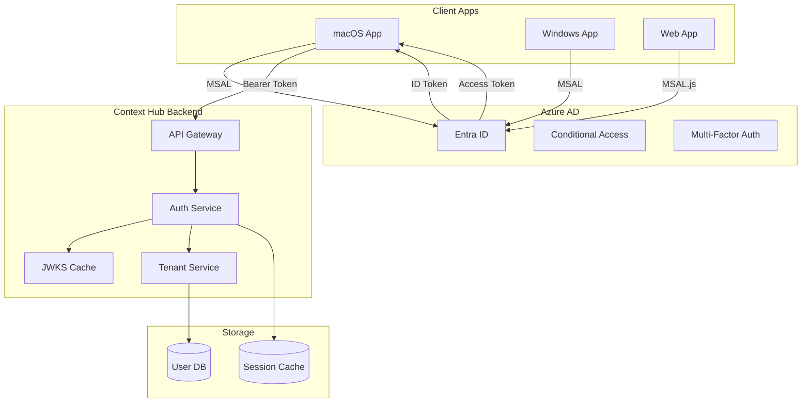

# Context Hub - Azure AD/Entra Authentication Design

## Overview

This document outlines the proper implementation of Azure AD (Entra ID) authentication for Context Hub, supporting enterprise-grade security, multi-tenancy, and SSO.

## Architecture



## 1. Application Registration

### Azure AD App Registration
```json
{
  "displayName": "Context Hub",
  "signInAudience": "AzureADMultipleOrgs",  // Multi-tenant
  "requiredResourceAccess": [
    {
      "resourceAppId": "00000003-0000-0000-c000-000000000000",  // MS Graph
      "resourceAccess": [
        {
          "id": "e1fe6dd8-ba31-4d61-89e7-88639da4683d",  // User.Read
          "type": "Scope"
        },
        {
          "id": "64a6cdd6-aab1-4aaf-94b8-3cc8405e90d0",  // email
          "type": "Scope"
        },
        {
          "id": "14dad69e-099b-42c9-810b-d002981feec1",  // profile
          "type": "Scope"
        }
      ]
    }
  ],
  "replyUrlsWithType": [
    {
      "url": "http://localhost:9899/callback",
      "type": "InstalledClient"  // For desktop apps
    },
    {
      "url": "https://api.contexthub.io/auth/callback",
      "type": "Web"
    }
  ],
  "allowPublicClient": true  // For desktop apps
}
```

## 2. Desktop App Implementation

### MSAL Integration for macOS
```rust
// Cargo.toml additions
[dependencies]
msal = "0.1"  // Microsoft Authentication Library
keytar = "0.1"  // Cross-platform keychain

// src/auth/azure.rs
use msal::{PublicClientApplication, TokenCache};
use serde::{Deserialize, Serialize};

const CLIENT_ID: &str = "your-app-client-id";
const AUTHORITY: &str = "https://login.microsoftonline.com/organizations";
const SCOPES: &[&str] = &[
    "https://contexthub.io/api/.default",
    "offline_access",  // For refresh tokens
];

pub struct AzureAuthManager {
    app: PublicClientApplication,
    cache: TokenCache,
}

impl AzureAuthManager {
    pub fn new() -> Result<Self> {
        let app = PublicClientApplication::builder(CLIENT_ID)
            .authority(AUTHORITY)
            .with_token_cache()?
            .build()?;
            
        Ok(Self { app, cache: TokenCache::new() })
    }
    
    pub async fn login_interactive(&self) -> Result<AuthResult> {
        // Use system browser for login
        let result = self.app
            .acquire_token_interactive(SCOPES)
            .with_prompt(Prompt::SelectAccount)
            .execute()
            .await?;
            
        Ok(AuthResult {
            access_token: result.access_token,
            id_token: result.id_token,
            account: result.account,
            expires_in: result.expires_in,
        })
    }
    
    pub async fn login_silent(&self, account: Account) -> Result<AuthResult> {
        // Try to get token from cache/refresh
        let result = self.app
            .acquire_token_silent(SCOPES, &account)
            .execute()
            .await?;
            
        Ok(result)
    }
    
    pub async fn get_accounts(&self) -> Result<Vec<Account>> {
        self.cache.get_accounts().await
    }
}
```

### Secure Token Storage
```rust
// src/auth/token_store.rs
use keytar::{get_password, set_password, delete_password};

pub struct SecureTokenStore {
    service: String,
}

impl SecureTokenStore {
    pub fn new() -> Self {
        Self {
            service: "io.contexthub.desktop".to_string(),
        }
    }
    
    pub fn store_tokens(&self, tokens: &TokenSet) -> Result<()> {
        // Store encrypted token set
        let encrypted = encrypt_tokens(tokens)?;
        set_password(&self.service, "tokens", &encrypted)?;
        
        // Store account info separately
        set_password(&self.service, "account", &tokens.account_id)?;
        
        Ok(())
    }
    
    pub fn get_tokens(&self) -> Result<Option<TokenSet>> {
        match get_password(&self.service, "tokens") {
            Ok(encrypted) => {
                let tokens = decrypt_tokens(&encrypted)?;
                Ok(Some(tokens))
            }
            Err(_) => Ok(None),
        }
    }
}
```

## 3. Server-Side Implementation

### Proper JWT Validation
```rust
// context-hub-core/src/auth/azure_ad.rs
use jsonwebtoken::{decode, decode_header, Algorithm, DecodingKey, Validation};
use reqwest::Client;
use serde::{Deserialize, Serialize};
use std::collections::HashMap;
use tokio::sync::RwLock;

#[derive(Clone)]
pub struct AzureADAuthenticator {
    tenant_id: String,
    client_id: String,
    jwks_cache: Arc<RwLock<JwksCache>>,
    allowed_tenants: Vec<String>,  // For multi-tenant scenarios
}

#[derive(Debug, Deserialize)]
pub struct AzureADClaims {
    pub sub: String,  // User object ID
    pub oid: String,  // Object ID (same as sub)
    pub tid: String,  // Tenant ID
    pub name: String,
    pub preferred_username: String,  // Email
    pub roles: Option<Vec<String>>,
    pub groups: Option<Vec<String>>,
    pub exp: i64,
    pub iat: i64,
    pub nbf: i64,
    pub aud: String,  // Should match your app ID
    pub iss: String,  // Issuer
    pub ver: String,  // Token version (2.0)
    
    // Custom claims from app roles
    pub extension_ContextHubRole: Option<String>,
    pub extension_StorageQuota: Option<i64>,
}

impl AzureADAuthenticator {
    pub async fn new(tenant_id: String, client_id: String) -> Result<Self> {
        Ok(Self {
            tenant_id,
            client_id,
            jwks_cache: Arc::new(RwLock::new(JwksCache::new())),
            allowed_tenants: vec![],
        })
    }
    
    pub async fn validate_token(&self, token: &str) -> Result<AzureADClaims> {
        // Decode header to get key ID
        let header = decode_header(token)?;
        let kid = header.kid.ok_or("No kid in token header")?;
        
        // Get JWKS from cache or fetch
        let jwks_uri = format!(
            "https://login.microsoftonline.com/{}/discovery/v2.0/keys",
            self.tenant_id
        );
        
        let key = self.jwks_cache.write().await
            .get_key(&jwks_uri, &kid).await?;
        
        // Configure validation
        let mut validation = Validation::new(Algorithm::RS256);
        validation.set_audience(&[&self.client_id]);
        validation.set_issuer(&[
            &format!("https://login.microsoftonline.com/{}/v2.0", self.tenant_id),
            &format!("https://sts.windows.net/{}/", self.tenant_id),
        ]);
        
        // Validate token
        let token_data = decode::<AzureADClaims>(
            token,
            &DecodingKey::from_rsa_components(&key.n, &key.e)?,
            &validation,
        )?;
        
        // Additional validation
        self.validate_claims(&token_data.claims)?;
        
        Ok(token_data.claims)
    }
    
    fn validate_claims(&self, claims: &AzureADClaims) -> Result<()> {
        // Check tenant is allowed (for multi-tenant)
        if !self.allowed_tenants.is_empty() && !self.allowed_tenants.contains(&claims.tid) {
            return Err(anyhow!("Tenant not allowed"));
        }
        
        // Check token version
        if claims.ver != "2.0" {
            return Err(anyhow!("Only v2.0 tokens supported"));
        }
        
        Ok(())
    }
}
```

### Tenant Isolation
```rust
// src/auth/tenant.rs
pub struct TenantManager {
    db: Arc<Database>,
}

impl TenantManager {
    pub async fn get_or_create_tenant(&self, aad_tenant_id: &str) -> Result<Tenant> {
        // Check if tenant exists
        if let Some(tenant) = self.db.get_tenant_by_aad_id(aad_tenant_id).await? {
            return Ok(tenant);
        }
        
        // Create new tenant with isolated storage
        let tenant = Tenant {
            id: Uuid::new_v4().to_string(),
            aad_tenant_id: aad_tenant_id.to_string(),
            name: format!("Tenant-{}", &aad_tenant_id[..8]),
            storage_shard: self.assign_storage_shard().await?,
            settings: TenantSettings::default(),
            created_at: Utc::now(),
        };
        
        self.db.create_tenant(&tenant).await?;
        Ok(tenant)
    }
    
    pub async fn get_user_tenant_context(&self, claims: &AzureADClaims) -> Result<TenantContext> {
        let tenant = self.get_or_create_tenant(&claims.tid).await?;
        
        // Get or create user within tenant
        let user = self.get_or_create_user(&tenant, claims).await?;
        
        Ok(TenantContext {
            tenant,
            user,
            permissions: self.get_user_permissions(&user, claims).await?,
        })
    }
}
```

### API Middleware
```rust
// src/api/middleware/azure_auth.rs
use axum::{
    extract::{Request, State},
    middleware::Next,
    response::Response,
};

pub async fn azure_auth_middleware(
    State(state): State<AppState>,
    mut request: Request,
    next: Next,
) -> Result<Response, StatusCode> {
    // Extract token
    let token = request
        .headers()
        .get("Authorization")
        .and_then(|h| h.to_str().ok())
        .and_then(|h| h.strip_prefix("Bearer "))
        .ok_or(StatusCode::UNAUTHORIZED)?;
    
    // Validate with Azure AD
    let claims = state.azure_auth
        .validate_token(token)
        .await
        .map_err(|_| StatusCode::UNAUTHORIZED)?;
    
    // Get tenant context
    let tenant_context = state.tenant_manager
        .get_user_tenant_context(&claims)
        .await
        .map_err(|_| StatusCode::INTERNAL_SERVER_ERROR)?;
    
    // Inject into request extensions
    request.extensions_mut().insert(tenant_context);
    
    Ok(next.run(request).await)
}
```

## 4. Enterprise Features

### Conditional Access Support
```rust
// Check for CAE (Continuous Access Evaluation) claims
if let Some(xms_cc) = claims.xms_cc {
    if xms_cc.contains("cp1") {
        // CAE-enabled token, check for revocation events
        self.check_cae_events(&claims).await?;
    }
}
```

### Group-Based Access
```yaml
# Azure AD App Manifest - App Roles
"appRoles": [
  {
    "allowedMemberTypes": ["User", "Application"],
    "displayName": "Context Hub Admin",
    "id": "admin-role-guid",
    "isEnabled": true,
    "value": "ContextHub.Admin"
  },
  {
    "allowedMemberTypes": ["User"],
    "displayName": "Context Hub User",
    "id": "user-role-guid",
    "isEnabled": true,
    "value": "ContextHub.User"
  }
]
```

### SSO Configuration
```rust
// Desktop app - automatic SSO
pub async fn try_sso_login(&self) -> Result<Option<AuthResult>> {
    // Get default account from OS
    let accounts = self.app.get_accounts().await?;
    
    if let Some(account) = accounts.first() {
        // Try silent login with cached credentials
        match self.login_silent(account.clone()).await {
            Ok(result) => Ok(Some(result)),
            Err(_) => Ok(None),  // Fall back to interactive
        }
    } else {
        Ok(None)
    }
}
```

## 5. Security Best Practices

### Token Security
1. **Never store tokens in config files**
2. **Use OS keychain/credential manager**
3. **Implement token refresh before expiry**
4. **Clear tokens on logout**

### Network Security
```rust
// Implement certificate pinning for Azure endpoints
let cert_der = include_bytes!("../certs/login.microsoftonline.com.der");
let client = reqwest::Client::builder()
    .add_root_certificate(Certificate::from_der(cert_der)?)
    .build()?;
```

### Audit Logging
```rust
#[derive(Serialize)]
struct AuthAuditLog {
    timestamp: DateTime<Utc>,
    user_id: String,
    tenant_id: String,
    action: AuthAction,
    ip_address: String,
    user_agent: String,
    success: bool,
    error: Option<String>,
}

enum AuthAction {
    Login,
    Logout,
    TokenRefresh,
    AccessDenied,
}
```

## 6. Implementation Roadmap

### Phase 1: Basic AAD Integration (1 week)
- [ ] Register app in Azure AD
- [ ] Implement MSAL in desktop app
- [ ] Basic token validation on server

### Phase 2: Tenant Isolation (1 week)
- [ ] Multi-tenant support
- [ ] Tenant-based data isolation
- [ ] User provisioning

### Phase 3: Enterprise Features (2 weeks)
- [ ] Conditional Access
- [ ] Group-based permissions
- [ ] Audit logging
- [ ] Admin portal

### Phase 4: Advanced Security (1 week)
- [ ] Certificate pinning
- [ ] Token binding
- [ ] Continuous Access Evaluation
- [ ] Zero Trust compliance

## Configuration Example

```yaml
# config/auth.yaml
authentication:
  provider: azure_ad
  azure_ad:
    tenant_id: "your-tenant-id"  # or "common" for multi-tenant
    client_id: "your-client-id"
    allowed_tenants:
      - "tenant-1-guid"
      - "tenant-2-guid"
    require_mfa: true
    allowed_groups:
      - "ContextHub-Users"
      - "ContextHub-Admins"
    
storage:
  multi_tenant: true
  isolation: tenant  # tenant | user | none
  
compliance:
  audit_retention_days: 90
  encrypt_at_rest: true
  data_residency: "US"  # US | EU | AUTO
```

This design provides enterprise-grade authentication with proper tenant isolation, SSO support, and compliance features suitable for large organizations.