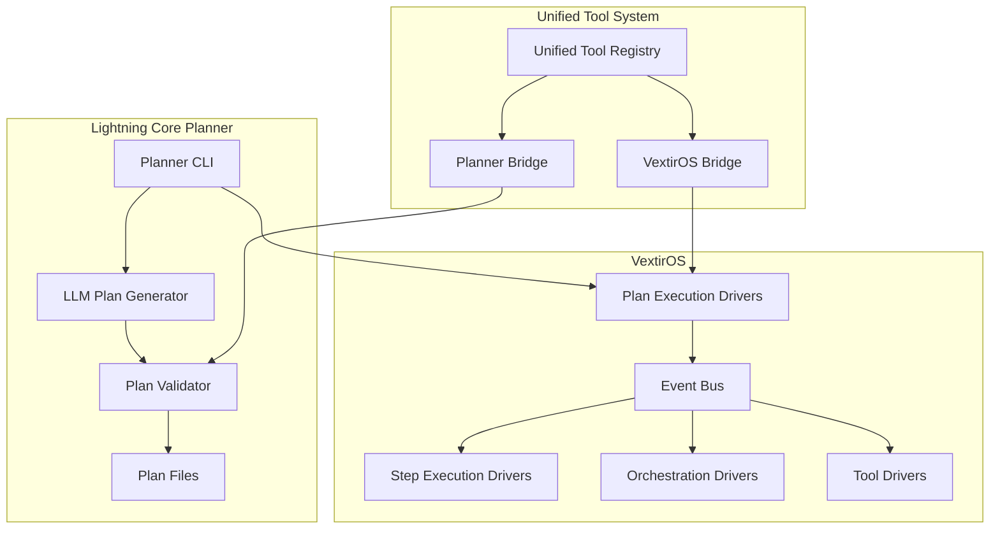

# Lightning Core: Planner-VextirOS Integration

This document describes the complete integration between the Lightning Core Planner and VextirOS systems, creating a unified workflow execution platform.

## Architecture Overview



## Key Components

### 1. Unified Tool Registry (`lightning_core/tools/`)

**Purpose**: Centralized tool management system that bridges planner and VextirOS tool systems.

**Key Files**:
- `registry.py` - Core unified registry with `ToolSpec` and `UnifiedToolRegistry`
- `planner_bridge.py` - Provides planner-compatible interface
- `vextir_bridge.py` - Provides VextirOS-compatible interface

**Features**:
- Single source of truth for all tools
- Automatic syncing between planner JSON and VextirOS registries
- Support for different tool types (Agent, Function, Native, MCP Server, API)
- Capability-based tool discovery

### 2. Plan Execution Drivers (`lightning_core/vextir_os/plan_execution_drivers.py`)

**Purpose**: VextirOS drivers that handle plan lifecycle and execution.

**Drivers**:
- `PlanExecutorDriver` - Handles plan setup, execution, and lifecycle management
- `PlanStepExecutorDriver` - Executes individual plan steps by invoking tools

**Capabilities**:
- Plan registration and setup
- Cron job configuration from plans
- Event-driven plan triggering
- Step-by-step execution with tool invocation
- Plan status monitoring

### 3. Enhanced Planner (`lightning_core/planner/planner.py`)

**New Functions**:
- `execute_plan()` - Creates plan execution events for VextirOS
- `setup_plan()` - Creates plan setup events for VextirOS
- `load_plan()` - Utility to load plans from files

**Integration Points**:
- Uses unified tool registry via planner bridge
- Emits structured events that VextirOS can process
- Maintains backward compatibility with existing planner API

### 4. Enhanced CLI (`lightning_core/planner/cli.py`)

**New Commands**:
- `execute <plan_file>` - Execute a plan via VextirOS
- `setup <plan_file>` - Set up a plan without executing
- Enhanced validation with parallel execution
- Comprehensive visualization and debugging

## Event Flow

### Plan Execution Flow

1. **Plan Creation**:
   ```bash
   lightning-planner generate "Daily email summary workflow" -o daily_plan.json
   ```

2. **Plan Validation**:
   ```bash
   lightning-planner validate daily_plan.json
   ```

3. **Plan Execution**:
   ```bash
   lightning-planner execute daily_plan.json --user-id user123
   ```

4. **VextirOS Processing**:
   - Planner emits `plan.execute` event
   - `PlanExecutorDriver` receives event
   - Plan is registered and set up
   - External events trigger plan steps
   - `PlanStepExecutorDriver` executes individual steps
   - Tools are invoked via unified registry

### Event Types

**Plan Events**:
- `plan.execute` - Execute a complete plan
- `plan.setup` - Set up plan without execution
- `plan.trigger` - Trigger specific plan with event
- `plan.status` - Get plan status

**Step Events**:
- `plan.step.execute` - Execute individual step
- `plan.step.completed` - Step execution completed
- `plan.step.failed` - Step execution failed

**Tool Events**:
- `tool.{action}` - Invoke specific tool action
- `cron.configure` - Configure cron job
- `schedule.create` - Create scheduled event

## Tool Integration

### Tool Definition Example

```python
from lightning_core.tools import ToolSpec, ToolType, get_tool_registry

# Define a new tool
email_tool = ToolSpec(
    id="email.send",
    name="Email Send",
    description="Send an email with subject and body",
    tool_type=ToolType.NATIVE,
    inputs={"to": "string", "subject": "string", "body": "string"},
    produces=["event.email.sent"],
    capabilities=["email_send", "communication"],
    config={"handler": "email_connector.send"}
)

# Register the tool
registry = get_tool_registry()
registry.register_tool(email_tool)
```

### Tool Usage in Plans

```json
{
  "plan_name": "daily-email-summary",
  "graph_type": "reactive",
  "events": [
    {"name": "event.daily.trigger", "kind": "cron", "schedule": "0 9 * * *"}
  ],
  "steps": [
    {
      "name": "send_summary",
      "on": ["event.daily.trigger"],
      "action": "email.send",
      "args": {
        "to": "user@example.com",
        "subject": "Daily Summary",
        "body": "Your daily summary is ready"
      },
      "emits": ["event.email.sent"]
    }
  ]
}
```

## Configuration

### Environment Variables

```bash
# VextirOS Configuration
COSMOS_CONNECTION=your_cosmos_connection_string
COSMOS_DATABASE=vextir
SERVICEBUS_CONNECTION=your_servicebus_connection_string

# OpenAI Configuration (for plan generation)
OPENAI_API_KEY=your_openai_api_key
```

### Registry Synchronization

The unified registry automatically syncs with:
- Existing planner JSON files (`registry.tools.json`)
- VextirOS tool registries
- Runtime tool registrations

## Usage Examples

### 1. Generate and Execute a Plan

```bash
# Generate a plan
lightning-planner generate "Create a workflow that monitors Air India flight status daily and sends email updates" -o flight_monitor.json

# Validate the plan
lightning-planner validate flight_monitor.json

# Execute the plan
lightning-planner execute flight_monitor.json --user-id airline_user
```

### 2. Set Up Recurring Plans

```bash
# Set up a plan for recurring execution
lightning-planner setup weekly_report.json --user-id report_user

# The plan will be registered with VextirOS and cron jobs configured
# External events will trigger the plan automatically
```

### 3. Tool Management

```bash
# List available tools
lightning-planner list-tools

# List available external events
lightning-planner list-events
```

### 4. Plan Visualization

```bash
# Generate visual diagram
lightning-planner visualize flight_monitor.json -o flight_monitor.png

# Generate Mermaid diagram
lightning-planner mermaid flight_monitor.json -o flight_monitor.md
```

## Advanced Features

### 1. Parallel Validation

The new validator system runs validations in parallel for better performance:

```python
from lightning_core.planner.validator import run_validations_parallel

results = run_validations_parallel(plan_data, max_workers=4)
```

### 2. Capability-Based Tool Discovery

```python
from lightning_core.tools import get_tool_registry

registry = get_tool_registry()
email_tools = registry.list_tools(capability="email_send")
scheduling_tools = registry.list_tools(capability="scheduling")
```

### 3. Event-Driven Architecture

VextirOS processes all plan operations through events, enabling:
- Asynchronous execution
- Event logging and monitoring
- Integration with external systems
- Scalable processing

### 4. Plan Lifecycle Management

- **Setup**: Register plan, configure cron jobs, validate dependencies
- **Execution**: Trigger initial events, monitor progress
- **Monitoring**: Track step completion, handle errors
- **Cleanup**: Manage plan lifecycle, resource cleanup

## Error Handling

### Plan Validation Errors

```python
from lightning_core.planner.validator import PlanValidationError

try:
    validate_plan(plan_data)
except PlanValidationError as e:
    print(f"Validation failed: {e}")
```

### Execution Errors

VextirOS drivers handle execution errors gracefully:
- Failed steps emit `plan.step.failed` events
- Plans can define error handling strategies
- Retry mechanisms for transient failures
- Comprehensive error logging

## Testing

### Unit Tests

```bash
# Run planner tests
python -m pytest tests/planner/

# Run VextirOS tests
python -m pytest tests/vextir_os/

# Run integration tests
python -m pytest tests/planner/test_planner_integration.py
```

### Integration Testing

```python
from lightning_core.planner.planner import execute_plan
from lightning_core.vextir_os.plan_execution_drivers import PlanExecutorDriver

# Test plan execution flow
event = execute_plan("test_plan.json", "test_user")
assert event["type"] == "plan.execute"
assert "plan" in event["metadata"]
```

## Deployment

### Development Setup

```bash
# Install dependencies
pip install -e .

# Set up environment
export OPENAI_API_KEY=your_key
export COSMOS_CONNECTION=your_connection

# Run tests
python -m pytest
```

### Production Deployment

1. **Configure Environment**: Set all required environment variables
2. **Register Drivers**: Ensure all VextirOS drivers are registered
3. **Tool Registry**: Sync unified tool registry with production tools
4. **Monitoring**: Set up logging and monitoring for plan execution
5. **Scaling**: Configure VextirOS for horizontal scaling

## Future Enhancements

### Planned Features

1. **Real-time Plan Monitoring**: Web dashboard for plan execution status
2. **Plan Templates**: Reusable plan templates for common workflows
3. **Advanced Scheduling**: More sophisticated scheduling options
4. **Plan Versioning**: Version control for plan definitions
5. **Performance Optimization**: Caching and optimization for large plans
6. **Integration APIs**: REST APIs for external system integration

### Extension Points

1. **Custom Validators**: Add domain-specific validation rules
2. **Custom Tools**: Register new tool types and capabilities
3. **Event Handlers**: Custom event processing logic
4. **Storage Backends**: Alternative storage for plans and execution data
5. **Notification Systems**: Custom notification channels

## Conclusion

The Lightning Core Planner-VextirOS integration provides a comprehensive workflow execution platform that combines:

- **Intelligent Planning**: LLM-powered plan generation with validation
- **Unified Tool Management**: Single registry for all system capabilities
- **Event-Driven Execution**: Scalable, asynchronous plan processing
- **Rich CLI Interface**: Complete command-line tooling
- **Extensible Architecture**: Easy to extend and customize

This integration enables users to create, validate, and execute complex workflows with natural language instructions while leveraging the full power of the VextirOS event-driven architecture.
