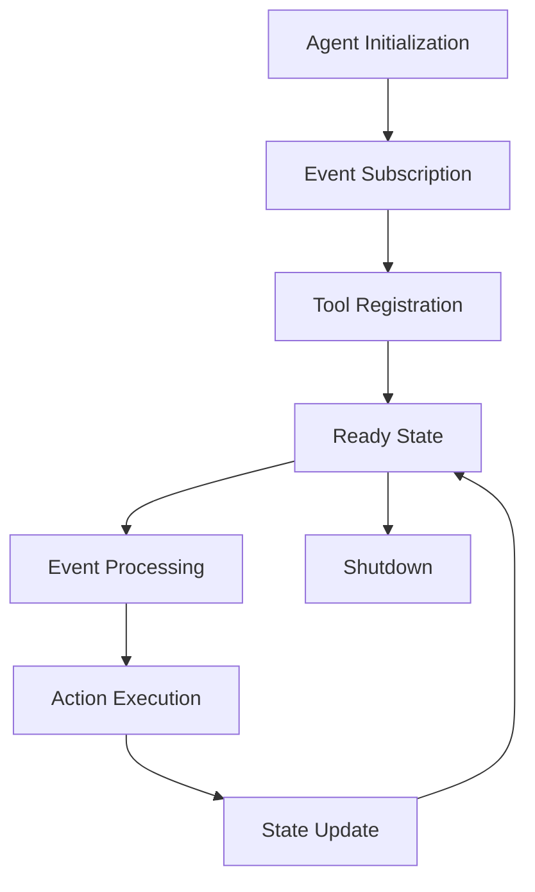

# Lightning Agents

Lightning OS includes a flexible agent system that orchestrates AI-powered autonomous workflows. Agents are specialized AI components that can perceive their environment, make decisions, and take actions.

## Agent Types

### Conseil Agent
**Purpose**: Research and analysis agent
- **Technology**: TypeScript/Node.js with pnpm
- **Capabilities**: 
  - Web research and data gathering
  - Document analysis and summarization
  - Knowledge synthesis
  - Report generation
- **Location**: `/agents/conseil/`

### Voice Agent  
**Purpose**: Voice interaction and real-time communication
- **Technology**: Next.js React application
- **Capabilities**:
  - Speech-to-text processing
  - Natural language understanding
  - Voice response generation
  - Real-time conversation management
- **Location**: `/agents/voice-agent/`

## Agent Architecture

### Core Components

1. **Agent Runtime**: Execution environment for agents
2. **Tool Bridge**: Interface between agents and Lightning tools
3. **Event Integration**: Agents consume and produce Lightning events
4. **State Management**: Persistent agent state and memory

### Agent Lifecycle



## Agent Development

### Creating a New Agent

1. **Create agent directory**:
   ```bash
   mkdir agents/my-agent
   cd agents/my-agent
   ```

2. **Implement agent interface**:
   ```typescript
   export class MyAgent implements Agent {
     async initialize(): Promise<void> {
       // Agent initialization
     }
     
     async processEvent(event: LightningEvent): Promise<void> {
       // Event processing logic
     }
     
     async shutdown(): Promise<void> {
       // Cleanup logic
     }
   }
   ```

3. **Register with Lightning**:
   ```typescript
   import { AgentRegistry } from '@lightning/agent-runtime';
   
   AgentRegistry.register('my-agent', MyAgent);
   ```

### Agent Configuration

Agents are configured through environment variables and configuration files:

```yaml
# agents/my-agent/config.yml
agent:
  name: "my-agent"
  version: "1.0.0"
  capabilities:
    - "data-processing"
    - "external-api"
  resources:
    memory: "512MB"
    cpu: "0.5"
  tools:
    - "web-search"
    - "document-parser"
```

## Agent Communication

### Event-Based Communication
Agents communicate through the Lightning event system:

```typescript
// Publishing events
await this.eventBus.publish({
  type: 'agent.task.completed',
  source: 'my-agent',
  data: { taskId: '123', result: 'success' }
});

// Subscribing to events
this.eventBus.subscribe('user.request', async (event) => {
  await this.handleUserRequest(event);
});
```

### Tool Integration
Agents can use Lightning tools:

```typescript
// Get available tools
const tools = await this.toolRegistry.getTools();

// Execute tool
const result = await this.toolRegistry.execute('web-search', {
  query: 'lightning ai framework',
  maxResults: 10
});
```

## Deployment

### Local Development
```bash
# Start individual agent
cd agents/conseil
pnpm install
pnpm dev

# Start all agents
docker-compose -f docker-compose.local.yml up agents
```

### Production Deployment
```bash
# Build agent images
docker build -t lightning-conseil agents/conseil

# Deploy with Lightning
kubectl apply -f deployments/agents/
```

## Agent Examples

### Simple Task Agent
```typescript
export class TaskAgent implements Agent {
  async processEvent(event: LightningEvent): Promise<void> {
    if (event.type === 'task.assigned') {
      const task = event.data as Task;
      const result = await this.executeTask(task);
      
      await this.eventBus.publish({
        type: 'task.completed',
        source: 'task-agent',
        data: { taskId: task.id, result }
      });
    }
  }
  
  private async executeTask(task: Task): Promise<any> {
    // Task execution logic
    return { status: 'completed' };
  }
}
```

### Research Agent
```typescript
export class ResearchAgent implements Agent {
  async processEvent(event: LightningEvent): Promise<void> {
    if (event.type === 'research.request') {
      const query = event.data.query;
      
      // Use web search tool
      const searchResults = await this.toolRegistry.execute('web-search', {
        query,
        maxResults: 5
      });
      
      // Analyze results
      const analysis = await this.analyzeResults(searchResults);
      
      // Publish findings
      await this.eventBus.publish({
        type: 'research.completed',
        source: 'research-agent',
        data: { query, analysis, sources: searchResults }
      });
    }
  }
}
```

## Best Practices

### Agent Design
- **Single Responsibility**: Each agent should have a focused purpose
- **Event-Driven**: Use events for communication, not direct calls
- **Stateless**: Agents should be stateless when possible
- **Error Handling**: Implement robust error handling and recovery

### Performance
- **Async Operations**: Use async/await for non-blocking operations
- **Resource Management**: Clean up resources properly
- **Batching**: Batch operations when possible
- **Caching**: Cache frequently accessed data

### Security
- **Input Validation**: Validate all inputs from events
- **Sandboxing**: Run agents in isolated environments
- **Permissions**: Use least-privilege principles
- **Audit Logging**: Log all agent actions

## Monitoring and Debugging

### Agent Metrics
- Event processing latency
- Success/failure rates
- Resource utilization
- Tool usage statistics

### Debugging Tools
- Event trace visualization
- Agent state inspection
- Performance profiling
- Log aggregation

### Health Checks
```typescript
export class MyAgent implements Agent {
  async healthCheck(): Promise<HealthStatus> {
    return {
      status: 'healthy',
      details: {
        eventQueueSize: this.eventQueue.length,
        lastProcessedEvent: this.lastProcessedEvent,
        uptime: this.uptime
      }
    };
  }
}
```